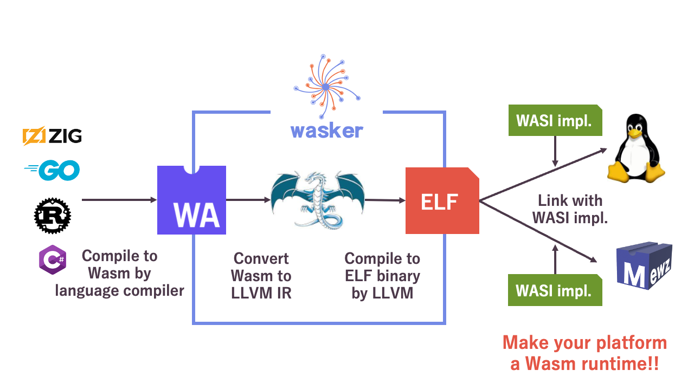

[](https://github.com/mewz-project/wasker/actions/workflows/ci.yaml)


# Wasker

Wasker is a WebAssembly compiler.
Wasker compiles Wasm binary into ELF format binary.　
Currently, Wasker supports WASI preview 1.



## What's new with Wasker

There are already software tools that compile Wasm to native binaries.

What's new with Wasker is, Wasker generates an **OS-independent** ELF file where WASI calls from Wasm applications remain **unresolved**.

This unresolved feature allows Wasker's output ELF file to be **linked with WASI implementations provided by various operating systems**, enabling each OS to execute Wasm applications.

Wasker empowers your favorite OS to serve as a Wasm runtime!


# Quick Start

## Step1: Install Wasker
```
curl -sSfL https://github.com/mewz-project/wasker/releases/download/v0.1.1/wasker-0.1.1-linux-$(uname -m)-gnu.tar.gz | tar -xzvC /usr/bin/ wasker
```

## Step2: Create Wasm binary
Create any Wasm binary.
Please refer [examples](./examples) for building Wasm from Rust and Go. 
### example
```
git clone https://github.com/mewz-project/wasker.git
cd examples/rust
rustup target add wasm32-wasi
cargo build --target wasm32-wasi
```

## Step3: Run Wasker to compile Wasm
```
$ wasker examples/rust/target/wasm32-wasi/debug/rust.wasm
[2024-03-19T12:10:20Z INFO  wasker::compiler] input: examples/rust/target/wasm32-wasi/debug/rust.wasm
[2024-03-19T12:10:20Z INFO  wasker::compiler] write to ./wasm.ll
[2024-03-19T12:10:20Z INFO  wasker::compiler] write to ./wasm.o, it may take a while
[2024-03-19T12:10:21Z INFO  wasker::compiler] Compile success
```

## Step4: Run compiled Wasm

ELF file generated by Wasker is OS-independent: WASI calls from Wasm applications remain unresolved.

Please write your own WASI wrapper for your favorite OS to be linked with Wasker output.

Here, we'll show a [tiny example](./examples/wasi-wrapper/wasi-wrapper-linux.c) of running Wasker output on Linux.

Link Wasker output and WASI wapper for Linux
```
gcc -no-pie ./examples/wasi-wrapper/wasi-wrapper-linux.c ./wasm.o -o hello
```

Run!!
```
./hello
```

Also please check [Mewz](https://github.com/Mewz-project/Mewz.git), a unikernel OS which has WASI interface. 
ELF file generated by Wasker can be executed on Mewz without any modification.


# Development
Wasker compiler is based on LLVM (LLVM 15 currently).


## Option1 : Use Devcontainer
You can try Wasker on browser via Devcontainer.

## Option2 : Build from source

The `wasker` binary distributed in Quick Start is dynamically linked with GNU libc (support for musl is planned for the future).
If pre-build binaries don't work on your system, please build from source.

### Clone repository
```
git clone git@github.com:mewz-project/wasker.git
cd Wasker
```

### Install LLVM locally
The commands are a little different because you need an LLVM binary built for your architecture.
#### AMD64
```
mkdir -p dependencies/llvm
wget https://github.com/llvm/llvm-project/releases/download/llvmorg-15.0.0/clang+llvm-15.0.0-x86_64-linux-gnu-rhel-8.4.tar.xz -O /tmp/llvm-15.0.0.tar.xz
tar -xvf /tmp/llvm-15.0.0.tar.xz -C dependencies/llvm
export LLVM_SYS_150_PREFIX=$PWD/dependencies/llvm/clang+llvm-15.0.0-x86_64-linux-gnu-rhel-8.4
```

#### AArch64
```
mkdir -p dependencies/llvm
wget https://github.com/llvm/llvm-project/releases/download/llvmorg-15.0.0/clang+llvm-15.0.0-aarch64-linux-gnu.tar.xz -O /tmp/llvm-15.0.0.tar.xz
tar -xvf /tmp/llvm-15.0.0.tar.xz -C dependencies/llvm
export LLVM_SYS_150_PREFIX=$PWD/dependencies/llvm/clang+llvm-15.0.0-aarch64-linux-gnu
```

### Run Wasker
```
cargo run helloworld.wat
```

